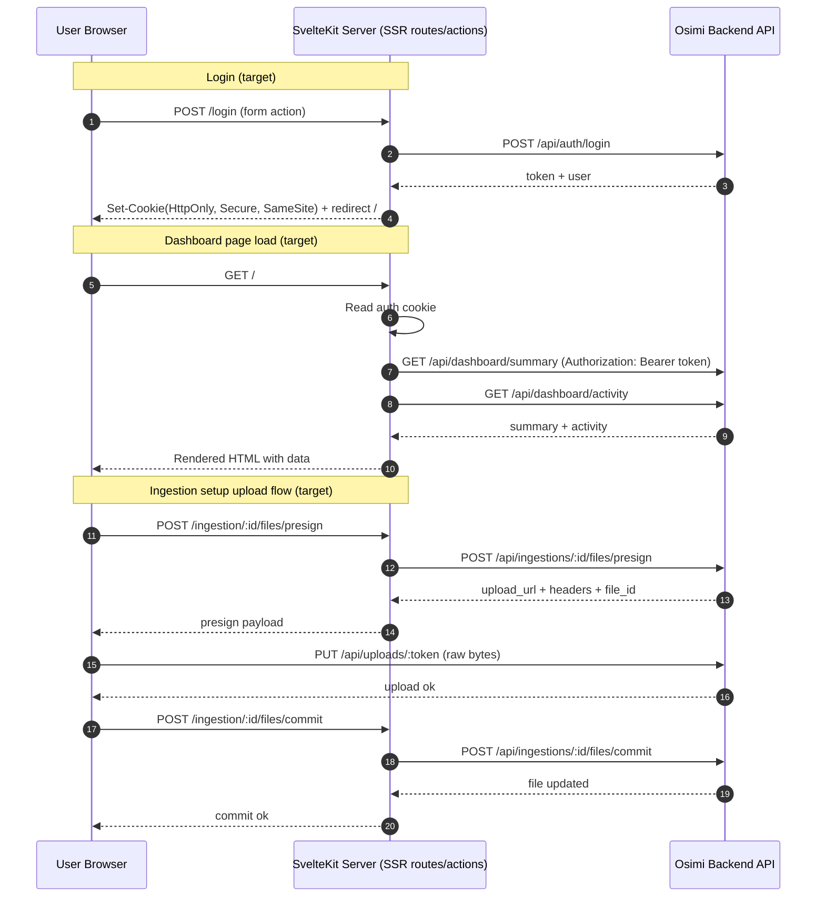

# Backend Integration Plan (Draft v0)

This is the initial working plan for wiring the existing UI views to the Osimi backend.

Status: draft, expected to evolve as implementation starts.

---

## 1) Context

- Main views are implemented and route structure is in place.
- Data is currently coming from mock services in `src/lib/services/index.ts`.
- API contract reference is available in `docs/api-reference.md`.
- We have chosen **secure cookie + SSR** as the auth/data-loading strategy.

---

## 2) Primary Goals

1. Replace mock data with real backend data for dashboard, ingestions, and objects.
2. Keep route loading server-first (`+page.server.ts`) where possible.
3. Use secure auth practices (HTTP-only cookie-backed session for SSR).
4. Preserve existing UI service interfaces to minimize churn in components.
5. Roll out incrementally with fallback options and clear verification steps.

## 3) Non-Goals (for initial rollout)

- Full worker API integration from the UI (explicitly out of scope).
- Rebuilding UI layout/design components.
- Implementing every future object detail/edit workflow in phase 1.

---

## 4) Key Decisions

### Decision A: Auth model

- Use **cookie + SSR** rather than localStorage token access.
- Server routes/actions read auth state from cookies and call backend with Bearer token.
- Client store remains for UI state display, but server data is source of truth.

### Decision B: Service boundary

- Keep `src/lib/services/*.ts` as the stable UI contract.
- Add API-backed implementations and swap through `src/lib/services/index.ts`.
- Maintain mock implementations only for not-yet-integrated routes and test/dev isolation.
- Do not fallback from real to mock for integrated routes; fail explicitly with proper error handling.

### Decision C: Mapping layer

- Introduce explicit DTO-to-UI mappers in service implementations.
- Do not leak raw API response shapes into page components.

### Decision D: Transport validation with Zod

- Use Zod at transport boundaries (backend responses and critical request/input payloads).
- Response schemas should be forward-compatible (`.passthrough()` / non-strict objects) to avoid breaking on additive backend fields.
- Request payload schemas should be strict (`.strict()`) to avoid sending accidental/unsafe extra fields.
- Apply `schema.safeParse(...)` in server code and normalize validation failures into app-level errors.

---

## 5) Request Flow Diagrams

These diagrams capture the architecture transition from current state to target state.

### Target state (secure cookie + SSR)

---

## 6) Workstreams

## WS1: Auth + session foundation

- Replace localStorage-first token flow with cookie-backed flow.
- Ensure login/logout/me routes work with SSR loads/actions.
- Centralize 401/403 handling and route redirection behavior.
- Update layout guard behavior to avoid race conditions on initial mount.

Deliverables:
- Cookie-aware auth utilities.
- Updated `session` loading behavior compatible with server loads.
- Clear unauthorized redirect rules.

## WS2: Shared API client

- Build a small API client helper for backend calls:
  - base URL handling
  - header injection
  - JSON parsing
  - standard error extraction (`request_id`, `error.code`, `error.message`)
- Normalize errors into app-level categories for consistent UX.
- Add response validation hooks that run Zod transport schemas before mapping.

Deliverables:
- `apiFetch` utility + typed error helpers.
- Validation utility for `safeParse` + normalized validation errors.
- Unit coverage for happy path + error parsing.

## WS2.1: Transport schemas + mappers

- Introduce schema modules under `src/lib/api/schemas/`:
  - `auth.ts`
  - `dashboard.ts`
  - `ingestions.ts`
  - `objects.ts`
  - `errors.ts` (standard backend error envelope)
- Introduce mapper modules under `src/lib/api/mappers/` to convert validated DTOs into UI service models.
- Keep page/component contracts unchanged by confining transport differences to schema+mapper layer.

Deliverables:
- Zod transport schemas for current integration endpoints.
- DTO-to-UI mappers with tests for optional/missing fields.

## WS3: Dashboard integration

- Wire dashboard service to:
  - `GET /api/dashboard/summary`
  - `GET /api/dashboard/activity`
- Map backend fields to `DashboardSummary` UI model.

Deliverables:
- API-backed `dashboardService` implementation.
- Dashboard page renders real metrics and recent activity.

## WS4: Ingestion list + create draft

- Wire ingestion overview service to `GET /api/ingestions`.
- Wire ingestion new action to `POST /api/ingestions`.
- Preserve existing create flow redirect to `/ingestion/[batchId]/setup`.

Deliverables:
- API-backed `ingestionOverviewService` and `ingestionNewService`.
- Real ingestion IDs and statuses in list/new flow.

## WS5: Objects list integration

- Wire objects service to `GET /api/objects`.
- Map list response and support pagination cursor.
- Connect initial filters to supported query params (`type`, `from`, `to`, `tag`, `limit`, `cursor`).

Deliverables:
- API-backed `objectsService`.
- Objects page using real list + recent strategy (if recent endpoint absent, derive from list slice).

## WS6: Ingestion setup upload lifecycle

- Implement staged file lifecycle in setup view:
  1. `POST /api/ingestions/:id/files/presign`
  2. `PUT /api/uploads/:token` (raw bytes)
  3. `POST /api/ingestions/:id/files/commit`
  4. `POST /api/ingestions/:id/submit`
- Add per-file status and retry handling in UI.

Deliverables:
- End-to-end ingestion setup flow backed by API.
- Clear user feedback on partial failures.

---

## 7) Suggested Implementation Order

Phase 1 (foundation)
- WS1 + WS2 + WS2.1

Phase 2 (read paths)
- WS3 + WS5

Phase 3 (write paths)
- WS4 + WS6

Phase 4 (hardening)
- error UX polish
- edge-case handling
- performance and reliability checks

---

## 8) API Usage Rules (UI-side)

- UI should use client APIs only (Bearer-protected `/api/*` routes for app users).
- Do not call worker lease/event APIs from UI routes.
- Respect cursor pagination (`next_cursor` -> `cursor`).
- Keep timestamps as ISO-8601 strings and format in UI only.
- Surface backend `request_id` in logs/error diagnostics when available.
- Validate backend payloads with Zod before mapping to UI models.
- Do not use strict response schemas for backend payloads unless endpoint contract is explicitly frozen.

---

## 9) Test Plan

- Unit tests for each service mapper:
  - valid payload mapping
  - missing/optional field handling
  - backend error shape parsing
- Unit tests for transport schemas:
  - additive response fields do not fail parsing
  - malformed payloads fail with normalized validation errors
- Unit tests for strict request schemas:
  - extra outgoing keys are rejected before network calls
- Route/server tests:
  - 401 redirects to login
  - 403 displays access-denied behavior
- Browser tests:
  - login -> dashboard
  - create ingestion draft -> redirect to setup
  - objects list renders API-backed rows

Commands:
- `npm run check`
- `npm run lint`
- `npm run test`
- targeted: `npx vitest run src/path/to/file.spec.ts`

---

## 10) Risks and Mitigations

- Risk: mismatch between current UI models and backend schema.
  - Mitigation: explicit mapper functions + schema-focused tests.

- Risk: auth race conditions between client store and SSR route guards.
  - Mitigation: server-first auth checks, deterministic redirect rules.

- Risk: upload flow complexity and partial failure cases.
  - Mitigation: per-file state machine + retry affordances.

- Risk: rollout regressions while replacing mocks.
  - Mitigation: feature flag/fallback switch for service implementations.

---

## 11) Definition of Done (Initial Integration)

- Dashboard, ingestion list/new, and objects pages read from real backend.
- Auth uses secure cookie + SSR-compatible flows.
- Ingestion setup can upload, commit, and submit real files.
- Mock mode remains available for local fallback.
- Core tests pass and main user journeys are verified.

---

## 12) Immediate Next Step

Start with WS1 (auth foundation): define cookie/session contract and update auth utilities so all server loads/actions can authenticate backend requests safely.
